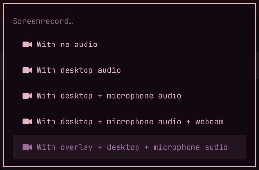
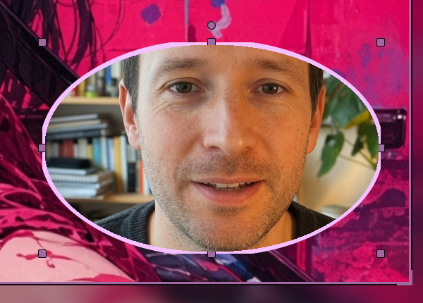
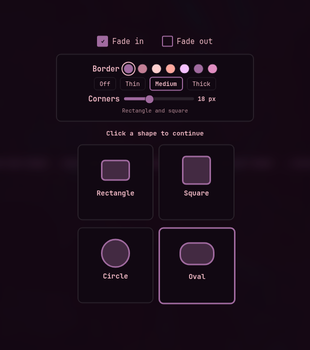

# Capture overlay for Omarchy

A fifth Screenrecord row. Stock Omarchy stays stock.



**Alt+Print → With overlay + desktop + microphone audio.** That row opens a live grab with 1080p snap guides, a webcam pip that is actually in the file, and handles that crop and zoom the camera.


Pull the handles to focus the shot inside the shape. The pip stays put; the video punches in. Super+Alt `[` / `]` resizes the frame. Oval rotates from the top knob.



On the grab you also get fade in/out, **Show keys** (Super/Ctrl/Alt chords; bare typing stays hidden), pip border, and corner radius, then rectangle, square, circle, or oval.



Fades are ffmpeg on the saved file. Border color comes from the theme.

## Install

```bash
omarchy plugin add https://github.com/imcmurray/omarchy-capture-overlay.git --enable
```

That loads the service. It does **not** rewrite your menu or Hyprland config. The extra Screenrecord row and fade-on-stop path still need the three snippets in `config/` — without them Alt+Print stays on stock screenrecord:

1. **Menu** — merge `config/omarchy-menu.jsonc` into `~/.config/omarchy/extensions/omarchy-menu.jsonc`
2. **Hyprland layers** — append `config/hyprland.lua` to `~/.config/hypr/hyprland.lua`
3. **Bindings** — append `config/bindings.lua` to `~/.config/hypr/bindings.lua` (unbinds stock Alt+Print and Super+Alt `[` / `]` first, and installs the Show keys hook)

The Hyprland snippet turns on `decoration.blur` (Omarchy looknfeel leaves it off) so the shape and camera pickers can frost the rest of the screen. It also adds layer rules for the picker, the live overlay, and the countdown.

```bash
hyprctl reload
omarchy restart shell
```

The marketplace card uses the same root `preview.png` as the hero above.

## Requirements

Omarchy Quattro with a webcam (`omarchy-hw-webcam`). Capture uses stock `gpu-screen-recorder` / `omarchy-capture-screenrecording`. Fades and the save toast use `ffmpeg`. Layer rules and the optional Show keys hook use Hyprland. No extra packages. No sudo or pkexec is required.

## Use

1. **Alt+Print** → **With overlay + desktop + microphone audio**
2. Drag a region, or click a 1080p / 720p / 900p guide. Arrow keys nudge it.
3. Set fade, **Show keys**, border, and corners, then click a shape
4. Drag the pip. Pull the handles to crop and zoom. Esc goes back
5. **Enter** for 3–2–1, then record
6. **Alt+Print** to stop — waits for the final render, then toasts

## Update

```bash
omarchy plugin update ianm.capture-overlay
```

## Remove

```bash
omarchy plugin remove ianm.capture-overlay
```

Then delete the three `config/` snippets if you want Alt+Print back on stock screenrecord, and `hyprctl reload`. Optional settings leftover:

```bash
rm -f ~/.config/omarchy/ianm.capture-overlay.json
```

Recordings in your Videos folder are left alone.

## Permissions

Runs as unsandboxed user code inside `omarchy-shell`. Overlay recordings open the webcam. Stop goes through plugin `record.sh` so fades render before the toast. Show keys reads Hyprland keyboard events only while the overlay has armed `$XDG_RUNTIME_DIR/ianm-capture-overlay/keys.on`; bare typing stays hidden. Pick results, the keys marker/HUD, the fade recipe, and the save-toast preview stay under that runtime directory via `bin/runtime-io` (atomic no-follow writes, bounded no-follow reads). `pick` IPC does not accept caller file paths. The camera recipe is parsed `KEY=VALUE` data, not shell.

## License

MIT. README shots use a generated indoor webcam stand-in, not a live camera. See `docs/CREDITS.md`.
