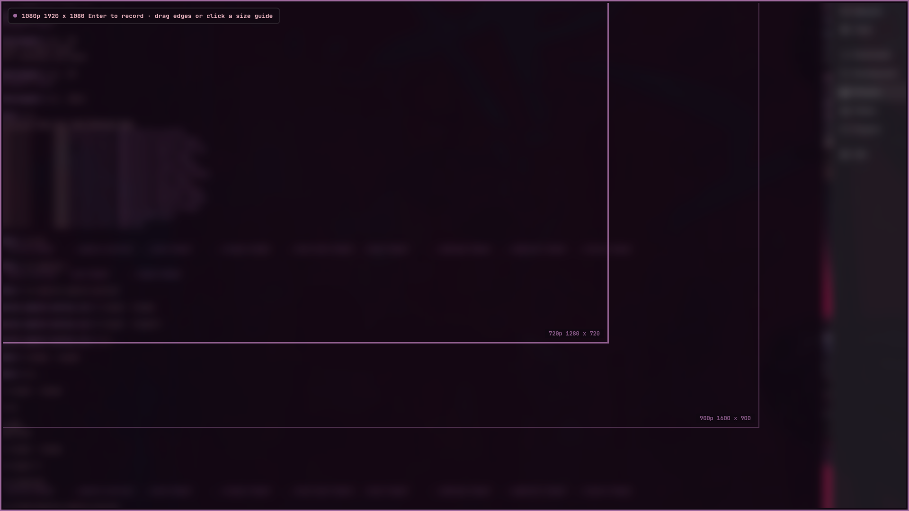

# Omarchy capture overlay

Replace slurp with a live grab: 1080p snap guides, a webcam pip that is actually in the recording, and optional fade in/out on the saved file.


The pip can be a rectangle, square, circle, or oval. Rectangle and square take a corner radius. Border color comes from the theme. Fade in/out is ffmpeg post on the final file, not on the live preview.

## Install

```bash
omarchy plugin add https://github.com/imcmurray/omarchy-capture-overlay.git --enable
```

That clones the plugin, validates the manifest, and loads the overlay service. `omarchy plugin update` can fast-forward it later.

Alt+Print still uses stock screenrecord until you wire the three snippets in `config/`:

1. **Menu** — merge `config/omarchy-menu.jsonc` into `~/.config/omarchy/extensions/omarchy-menu.jsonc` so the recording rows call this plugin’s `record.sh`.
2. **Hyprland layers** — append `config/hyprland.lua` to `~/.config/hypr/hyprland.lua`.
3. **Bindings** — append `config/bindings.lua` to `~/.config/hypr/bindings.lua` (unbinds stock Alt+Print and Super+Alt `[` / `]` first).

Then:

```bash
hyprctl reload
omarchy restart shell
```

## Use

1. **Alt+Print** → **With desktop + microphone audio + webcam**
2. Drag a region (click a size guide or pull the edges)
3. Set fade, border, and corner radius, then click **Rectangle**, **Square**, **Circle**, or **Oval** to continue (Esc from the next step returns here)
4. Drag the pip; grab the handles to crop the camera inside the shape (oval also rotates from the top knob). If more than one camera is plugged in, pick it from the menu under the preview. Super+Alt `[` / `]` resizes the pip. **Esc** to go back
5. **Enter** for 3–2–1, then record
6. **Alt+Print** again to stop (waits for the final render, then toasts)

Without webcam, the same picker still wraps the other screenrecord menu rows.




## Update

```bash
omarchy plugin update ianm.capture-overlay
```

## Remove

```bash
omarchy plugin remove ianm.capture-overlay
```

That disables and deletes the plugin checkout. Remove the three `config/` snippets from your menu, Hyprland, and bindings if you want Alt+Print back on stock screenrecord, then `hyprctl reload`.

## Layout

| Path | Role |
| --- | --- |
| `Service.qml` | Overlay service: picker, IPC, pip drag |
| `CamPreview.qml` | Qt Multimedia live camera + countdown surface |
| `PickerModel.js` | Snap guides and hit testing |
| `record.sh` / `pick.sh` | Menu entry; region IPC |
| `bin/compose-cam` | Fade in/out on the saved file |
| `bin/test-core` | Script and picker unit tests |
| `bin/test-overlay` | Unit tests plus idle / menu / picker checks |
| `ROADMAP.md` | Later work: in-grab options panel (fades, length, countdown) |

## License

MIT
